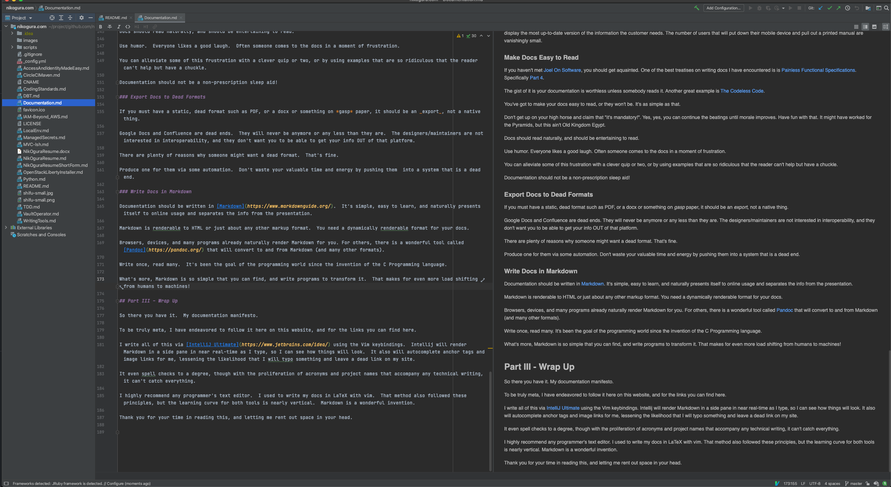

# The Documentation Problem

*Documentation is like Pizza:  When it's good, it's really, really good.  When it's bad, it's still pizza.*

Since the dawn of time, there have been people who have been able to figure stuff out.  They don't necessarily even know what they're doing, or how.  They just can pull it off.  Don't you just _hate_ those smug bastards?

The rest of us need to _learn_, and face it, written language is really king where learning is concerned.  It's been that way for thousands of years.

But documentation is hard to do well.  Sure, something is better than nothing, but if we look at it from a behavioral and philosophical standpoint, we can take much of the sting out of the process of writing and maintaining documentation.

## Part I: Philosophy

### Falconry

I used to be a Falconer.  That is I used to train Birds of Prey, both for use in educational demonstrations and for hunting.

I would fly birds before large crowds, and all by myself out in the boonies.   As you can imagine, when you're wandering around with a hawk on your wrist you get lots of attention from passers by.  Many purported 'hunting trips' became impromptu flight demonstrations and seminars on birds, wildlife, conservation, the nature of predation, etc.

The most common question I was asked was "How do you get the bird to come back to you?".  Picture it:  You have a free flying bird.  Why in the world would it come back to this human weirdo to be stuffed back into a box and taken home to what amounts to a shack with bars on the windows?  Wouldn't the hawk rather be 'free'?  It doesn't make sense.

How do you get the bird to come back?  The short answer is "magic".

You don't control a hawk.  They are solitary predators with less social graces than your average programmer.  Hawks do what hawks do and buddy you had better just get used to it.

What I did was, armed with a knowledge of what 'hawks do', carefully construct the situation so that what 'hawks do' happened to look like what I wanted.  That's it.

I looked like a wizard, but it was really just some insight and careful staging of the scene.

### Chinese Philosophy and Murphy's Law

In Chinese philosophy, the term for this is "Wu Wei" - usualy translated as "doing without doing".  Esoteric Eastern B.S.?  Not really.  Lemme 'splain.

The trick is to construct a system wherein things naturally roll into their proper channel - like water rolling down hill.  You don't have to tell water how to roll down hill.  It just does, and you can power whole cities with it.

My philosophy of documentation (and all things technical) stems from this insight, and from a great appreciation of the other fundamental law of the Universe: Murphy's Law. i.e. "Anything that can possibly go wrong - will".

If it's possible for docs to be left out- they will be.  If it's easier for docs to be left to rot - they will be.  

We're talking Human nature here, and the nature of the Universe.  Everything sort of goes its own way appointed, and in its own time.  Our interference often means a lot less than we imagine.

### Martial Arts

I've practiced and taught the martial arts for over 30 years.  I owned and operated my own studio for 9.  I've fought with and without pads, with weapons and without.  I have actual sword scars.  No, I'm not going to show you.

In that time, I met a lot of people with fantastic physical abilities, and people who were falling apart. I met people steeped in tactics, and people who's ideas of fighting came from watching too many B movies.

I studied and taught many techniques that were absolutely amazing in their execution, requiring years of training to perfect. I was puzzled by some of these moves.  They seemed fantastically difficult to get right.  The potential for self-injury was very high, even leaving out the idea that there was this opponent who was actively trying to hurt you.

When I asked one of my teachers about it, he referred to them as "Your Day Moves".  It would work well if it turned out to be "Your Day".  i.e. if everything unfolded exactly as planned.  Yeah.  How many days like that do _you_ have?  Me neither.

What grew from this experience is the idea that we needed to avoid tactics that required a great number of factors to resolve in our favor and instead rely on moves that were more likely to succeed than to fail.  A good tactic was one that still worked as intended even when a maximum number of factors went _against_ you.

The humorous acronym for this idea is the K.I.S.S. principle: Keep It Simple, Stupid.

When a student came up with some elaborate movie move they wanted to use I would always ask "Do you want to bet your nose on it?".  When they invariably were puzzled I would explain: 

If it works, great.  The fight is over.  If it doesn't, you're off balance, out of position, and it's likely your opponent will be easily take advantage, which could result in your broken nose.  Do you want to bet your nose on that move working?

Usually the answer was "no".  When shit happens, simple is best.  When we're trying to deliver quality products together with useful documentation on a tight schedule, shit is inevitably happening.

Our documentation process then must have as few moving parts as possible, and rely on as few breakpoints as we can arrange.  

The more steps required - especially tedious ones- the more likely it is that one will be not be done, and then the process fails and the docs rot.

### The Perfect System

*A perfect system then is one that makes it more likely that docs will be written and maintained than not, and one that is more likely to succeed than it is to fail.*  

We can approach this perfection by:

* Making the writing and maintainence process painless and natural for the ultimate source of the information- the authors of the system.  Others will definitely want to proof-read and review, but the author of the code is the authority on how it should work.  Anyone else is just helping.

* Separate Information from Presentation - because the information doesn't change as often as the presentation, and the presentation must vary depending on where the docs are being presented.  Machines can handle presentation and rendering.  They can't help with original content.

* Write docs in a format that they can be presented to the widest possible audience, and be rendered on the fly in any format we desire.

* Leverage automation to handle changes that merely require precision and speed.  Save the humans to do things only humans can do.

By smoothing the rough edges of the writing process we make it more likely that the process will be followed than not.  In the end, you roll the dice and see what happens, but we can weight the chances in our favor.

I can already hear people say "I've seen people succeed with tool X or method Y".  Yup.  Sure.  You _can_ make anything work, and someone somewhere probably has.  

I still say "Do you want to bet your nose on that?".  

K.I.S.S.  Face it, when the tension mounts, none of us are exactly at our best.  

Our system needs to cater to the worst case scenario, not the best.

## Part II: Execution

What follows is the best method I've come across so far in achieving the above goals.

### Docs Contain Information, not Presentation

Similar to the MVC pattern (Model, View, Controller), the info your docs convey - the Model, needs to stay separate from the way it's presented - the View.

Presentation changes depending on branding and fashion.  The information that describes how your code works doesn't change with anywhere near the speed.

Furthermore, making your docs simultaneously available on multiple devices pretty much means your formatting needs to be rendered on the fly by a machine. A MS Word doc that looks fine on your 27" Apple Display might be utterly unreadable on somebody's phone.

### Don't Maintain Multiple Versions

If you have N versions of a document, how are you ensuring that they all stay in sync and up to date?  Sure it can be done, but will it?

Sidestep this problem entirely by having a single version.  If you need to render it in multiple formats fine - that's a job for a computer.  

Humans should never need to look beyond a single canonical source of truth.

### Keep Docs in Same Repo as Code

That single canonical source of truth needs to be the same repository as that used for the code itself.

Docs are instructions for a human.  Code is instruction for a machine.  Docs are only good insofar as they match machine instruction, ergo they must be linked.  The easiest way to maintain that link is to keep them in the same repo.

### Keep Docs Up to Date

Docs are dead as soon as they're unmaintained and out of step.  How many manuals and architectural diagrams have you seen that were written once long ago and haven't been updated?  In my experience, that's most of them.

The problem here is that programs - whose features are driven by product teams are dynamic by nature.  There's always a desire for a new feature.  Usually there are whole teams of people pushing for changes to software.

The docs on the other hand are a tedious thing that nobody really pushes for.  As long as the features are delivered, that's the end of things.  There's also this prevalent myth that a user interface is 'intuitiive'.  Nonsense.

> The only "intuitive" interface is the nipple.  After that it's all learned.  --Bruce Ediger

Every product needs instructions.  Those instructions must evolve as the product itself evolves.  Maintaining the docs needs to be part of the job as much as maintaining the code and the tests are.

By putting them all in the same repository, and making them all a part of the same review process, we give ourselves a fighting chance of keeping everything in sync.

### Make Docs Available Online

It's a connected world.  Customers need to be able to get the information they require at a touch of a button without leaving the native presentation format of the product.  In other words, a phone app shouldn't need people to open their laptop, or dig out a printed manual.

It is imperative in the modern world that docs be online, and available from any device with a network connection.  Docs need to be easy to read or they won't be - They also need to be easy to _find_.

Where possible, your docs should be directly linkable from your product.  Customer has a problem with a feature?  There should be an icon or link or popup there ready to display the most up-to-date version of the information the customer needs.  The number of users that will put down their mobile device and pull out a printed manual are vanishingly small.

### Make Docs Easy to Read

If you haven't met [Joel On Software](joelonsoftware.com), you should get aquainted.  One of the best treatises on writing docs I have encountered is is [Painless Functional Specifications](https://www.joelonsoftware.com/2000/10/02/painless-functional-specifications-part-1-why-bother/).  Specifically [Part 4](https://www.joelonsoftware.com/2000/10/15/painless-functional-specifications-part-4-tips/).

The gist of it is your documentation is worthless unless somebody reads it.  Another great example is [The Codeless Code](http://thecodelesscode.com/case/169).

You've got to make your docs easy to read, or they won't be.  It's as simple as that.

Don't get up on your high horse and claim that "it's mandatory!".  Yes, yes, you can continue the beatings until morale improves.  Have fun with that.  It might have worked for the Pyramids, but this ain't Old Kingdom Egypt.

Docs should read naturally, and should be entertaining to read.  

Use humor.  Everyone likes a good laugh.  Often someone comes to the docs in a moment of frustration.  

You can alleviate some of this frustration with a clever quip or two, or by using examples that are so ridiculous that the reader can't help but have a chuckle.  

Documentation should not be a non-prescription sleep aid!

### Export Docs to Dead Formats

If you must have a static, dead format such as PDF, or a docx or something on *gasp* paper, it should be an _export_, not a native thing.

Google Docs and Confluence are dead ends.  They will never be anymore or any less than they are.  The designers/maintainers are not interested in interoperability, and they don't want you to be able to get your info OUT of that platform.

There are plenty of reasons why someone might want a dead format.  That's fine.  

Produce one for them via some automation.  Don't waste your valuable time and energy by pushing them  into a system that is a dead end.

### Write Docs in Markdown

Documentation should be written in [Markdown](https://www.markdownguide.org/).  It's simple, easy to learn, and naturally presents itself to online usage and separates the info from the presentation.

Markdown is renderable to HTML or just about any other markup format.  You need a dynamically renderable format for your docs.  

Browsers, devices, and many programs already naturally render Markdown for you. For others, there is a wonderful tool called [Pandoc](https://pandoc.org/) that will convert to and from Markdown (and many other formats).  

Write once, read many.  It's been the goal of the programming world since the invention of the C Programming language.

What's more, Markdown is so simple that you can find, and write programs to transform it.  That makes for even more load shifting from humans to machines!

## Part III - Wrap Up

So there you have it.  My documentation manifesto.

To be truly meta, I have endeavored to follow it here on this website, and for the links you can find here.

I write all of this via [IntelliJ Ultimate](https://www.jetbrains.com/idea/) using the Vim keybindings.  Intellij will render Markdown in a side pane in near real-time as I type, so I can see how things will look.  It also will autocomplete anchor tags and image links for me, lessening the likelihood that I will typo something and leave a dead link on my site.  

It even spell-checks to a degree, though with the proliferation of acronyms and project names that accompany any technical writing, it can't catch everything.  It does nag me about improper use of "its" vs "it's" though, which is nice.  My junior high grammar teacher would be pleased.

I highly recommend any programmer's text editor.  There's a learning curve, I admit, but they're tools created to make keeping track of 200k+ lines of text not only _possible_, but _easy_.  They work too.  The docs for any complex system are at least as involved as the code for the system.  Use the tools the pros use.

I used to write my docs in LaTeX with vim.  That method also followed these principles, but the learning curve for both tools is nearly vertical.  Markdown is a wonderful invention.  

